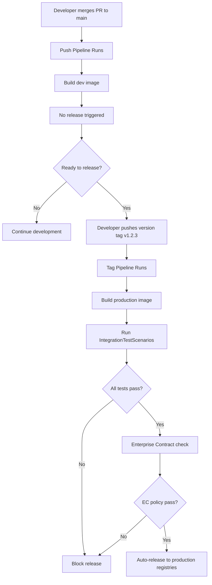
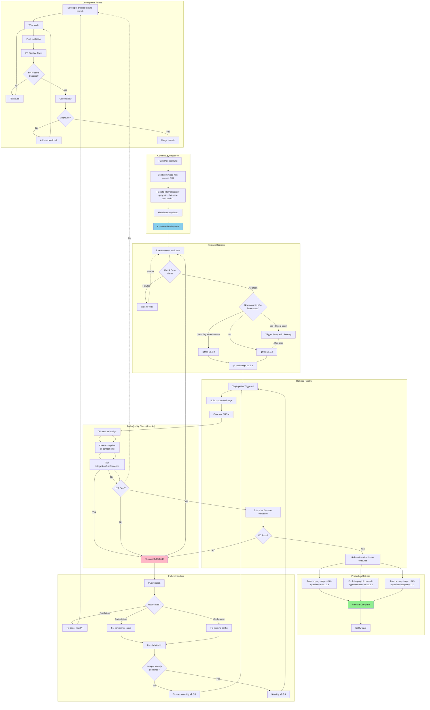
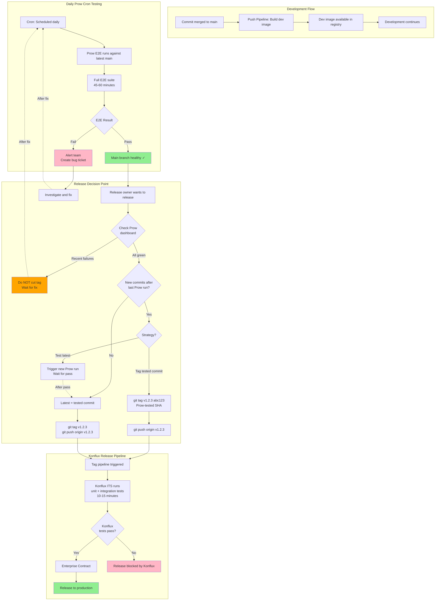
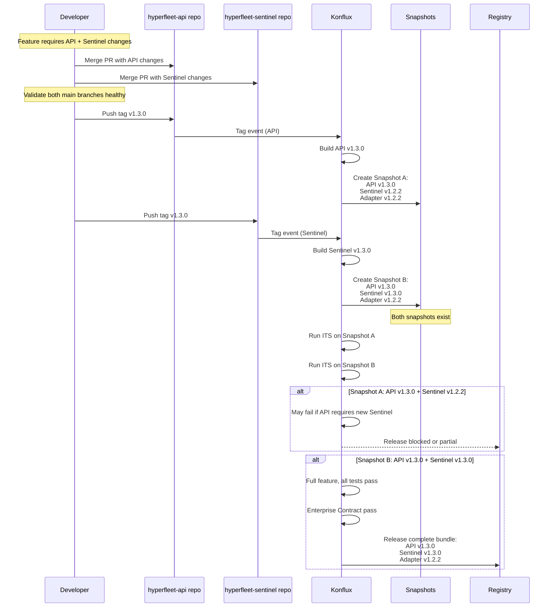
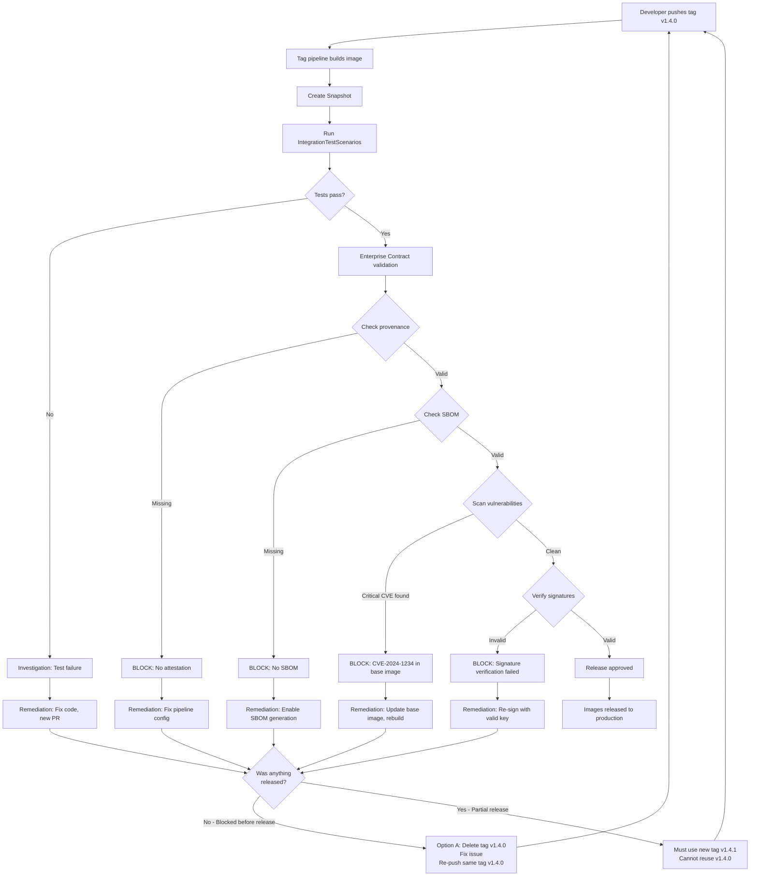
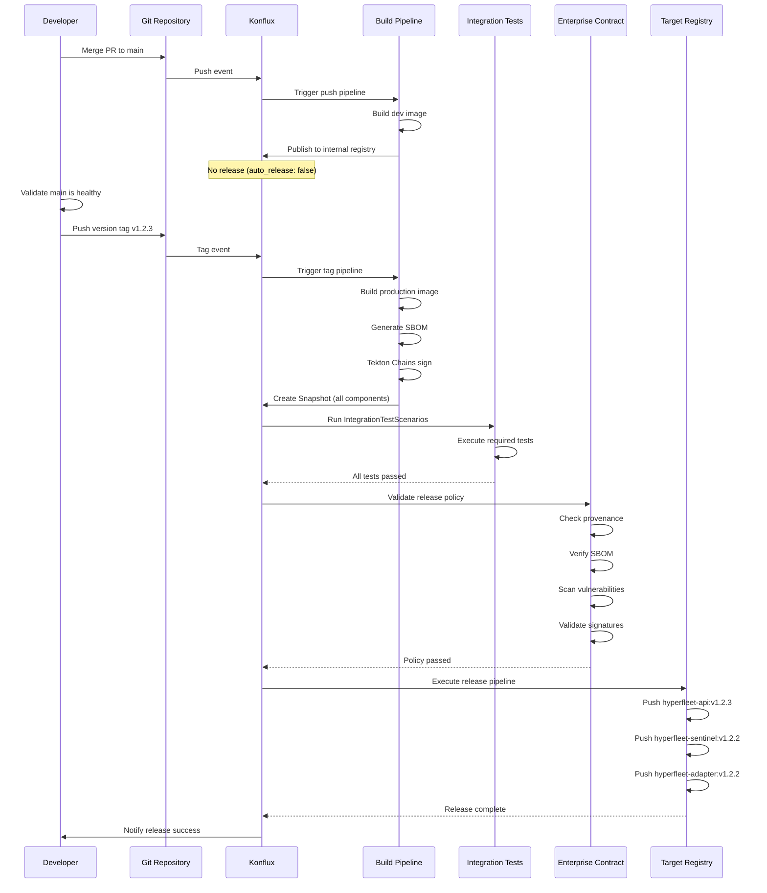

# Konflux Release Pipeline Strategy for HyperFleet Components

**Metadata**
- **Status**: Draft
- **Owner**: HyperFleet Team
- **Last Updated**: 2026-04-08

---

## Overview

This document defines the Konflux release pipeline strategy for HyperFleet's three core components: API Service, Sentinel, and Adapter. The strategy implements tag-triggered releases with existing Prow E2E test integration, avoiding auto-releases on every commit while maintaining quality gates.

## Context

HyperFleet is onboarding to Konflux (HYPERFLEET-830) and requires a release strategy that:
- Integrates with existing Prow E2E tests as a release gate
- Avoids releasing on every commit to main
- Supports tag-triggered releases for explicit release control
- Handles coordinated bundle releases of all three components

## Konflux Release Pipeline Design

Konflux implements a three-stage release pipeline. **Important**: Not all builds proceed through all stages—only tag-triggered builds reach the Release Stage. Commits to main stop after Integration Testing.

### 1. Build Stage

**Purpose**: Build container images with provenance and compliance artifacts

**Trigger**: Commits to main (push pipeline) OR repository tags (tag pipeline)

**Process**:
- Tekton pipeline defined in `.tekton/` directory triggers on commits or tags
- Builds OCI-compliant container image
- Generates Software Bill of Materials (SBOM)
- Tekton Chains automatically creates provenance attestations
- Publishes build artifacts to internal registry

**Output**: Immutable image with signed attestations

**Note**: Both push and tag pipelines execute this stage, but only tag pipelines have `auto_release: true` to proceed to Release Stage

### 2. Integration Testing Stage

**Purpose**: Validate changes before release using IntegrationTestScenario (ITS)

**Process**:
- All registered ITS pipelines execute against the Snapshot
- Snapshot contains images for ALL components in the Application
- All required tests must pass before Snapshot promotion
- Failed tests block release pipeline (tag pipeline only)

**Test Scenarios**:
- **Fast ITS** (5-10 min): Unit tests, integration tests, linting - runs for all Snapshots
- **E2E ITS** (20-30 min, tier0 test cases): End-to-end test suite - configured to run only for tag-triggered Snapshots to validate the exact version combination being released

**Output**: 
- **For push pipeline**: Validated Snapshot (stops here, no release)
- **For tag pipeline**: Validated Snapshot ready for Release Stage evaluation

**Note**: Integration tests run for both push and tag pipelines, but only tag pipelines proceed to Release Stage

### 3. Release Stage

**Purpose**: Apply policy checks and publish to target registries

**Trigger**: Repository tag creation (e.g., `v1.2.3`), NOT main code commits

**Process**:
- Tag event triggers tag pipeline with `auto_release: true`
- Enterprise Contract (EC) policy validation
- EC checks for required attestations, vulnerabilities, approved dependencies
- Release pipeline executes on policy pass
- ReleasePlanAdmission maps components to target registries
- Artifacts published to production registries

**Output**: Released images in target registries with full audit trail

**Note**: Push to main branch does NOT trigger Release Stage due to `auto_release: false` in push pipeline configuration (see [HyperShift example](https://github.com/openshift/hypershift/pull/5869))

## Tag-Based Release Trigger Strategy

### Pipeline Structure Per Component Repository

Each component repository (hyperfleet-api, hyperfleet-sentinel, hyperfleet-adapter) will have three pipeline types:

#### PR Pipeline (`.tekton/pr.yaml`)
```yaml
# Triggers on: Pull request events
# Purpose: Fast validation before merge
# Actions:
#   - Linting and code quality checks
#   - Unit tests
#   - Build verification (no image push)
# Release: No
```

**Rationale**: Provides fast feedback (< 5 minutes) to developers without consuming registry quota or creating unnecessary artifacts.

#### Push Pipeline (`.tekton/push.yaml`)
```yaml
# Triggers on: Push to main branch
# Purpose: Build and test merged changes
# Actions:
#   - Build OCI image
#   - Push to development registry
#   - Generate SBOM and attestations
# Release: No (auto_release: false)
```

**Rationale**: Maintains continuous integration for main branch, provides images for integration testing, but does NOT trigger production releases. This prevents every merge from creating a new release.

#### Tag Pipeline (`.tekton/tag.yaml`)
```yaml
# Triggers on: Git tag matching pattern refs/tags/v*
# Purpose: Trigger production release
# Actions:
#   - Build OCI image with version tag
#   - Run all IntegrationTestScenarios
#   - Enterprise Contract validation
#   - Auto-release on success
# Release: Yes (auto_release: true)
```

**Rationale**: Explicit release control. Developer pushes version tag (e.g., `v1.2.3`) only when ready to release. Tag creates immutable reference point for release artifacts.

### Release Workflow



### Tag Naming Convention

- **Version tags**: `v<major>.<minor>.<patch>` (e.g., `v1.2.3`)
- **Pre-release tags**: `v<major>.<minor>.<patch>-rc<number>` (e.g., `v1.2.0-rc1`)
- **Pattern matching**: `refs/tags/v*` captures all version tags

Only tags matching the pattern will trigger release pipelines.

### Complete Development-to-Release Workflow

This diagram shows the full workflow from feature development through production release:



**Timeline estimates**:
- PR Pipeline: 3-5 minutes
- Push Pipeline: 5-8 minutes
- Prow E2E (daily cron): 45-60 minutes (async, doesn't block)
- Tag Pipeline Build + Fast ITS: 10-15 minutes
- E2E ITS (tier0, tag-triggered only): 20-30 minutes
- Enterprise Contract + Release: 5-10 minutes
- **Total time from tag push to production**: ~35-55 minutes

## Integration with Existing Prow E2E Tests

### Current State

HyperFleet has Prow-based E2E tests running via cron (scheduled daily), not as presubmit jobs on PRs or commits.

### Integration Strategy

**Decision**: Keep Prow E2E tests as existing health checks, do NOT wrap in Konflux IntegrationTestScenario.

**Implementation**:
1. Prow continues to run E2E tests via daily cron schedule (existing behavior)
2. Prow E2E failures do NOT block merges (not a presubmit job), but inform release owner not to cut tags until tests pass
3. **Critical**: Release owner MUST tag the specific commit SHA that passed Prow E2E, OR trigger a new Prow run against latest commit before tagging
   - If nightly Prow passed at commit `abc123`, and new commits `def456` were merged after, either:
     - Option A: Tag commit `abc123` (the tested commit): `git tag v1.2.3 abc123`
     - Option B: Trigger new Prow run against `def456`, wait for pass, then tag `def456`
   - DO NOT tag untested commits (commits merged after last successful Prow run)
4. Tag-triggered releases rely on:
   - Unit/integration tests in Konflux pipelines
   - Release owner validation of Prow E2E status before tagging
   - Post-release monitoring

**Rationale**:
- Prow E2E tests run via cron (daily scheduled) and would trigger unwanted releases if used as release gate
- Wrapping Prow in Tekton IntegrationTestScenario adds complexity (requires openshift/konflux-tasks)
- Daily E2E failures should not create release artifacts or tags
- Release owner manually validates Prow status before tagging ensures releases happen only when system is healthy

### Prow E2E Integration Workflow

This diagram shows how Prow E2E runs via daily cron for quality assurance without being a release gate:



**Key Points**:
- Prow E2E runs **via daily cron** (scheduled), not on PRs or commits
- Prow failures **do NOT block merges** (not a presubmit job)
- Prow failures **inform release owner** not to cut tags until tests pass
- **CRITICAL**: Release owner must tag the **exact commit SHA that passed Prow E2E**, or trigger new Prow run against latest commit
  - If commits were merged after last successful Prow run, either tag the tested commit or re-run Prow first
  - DO NOT tag untested commits (commits merged after last Prow success)
- Release owner **manually validates** Prow status before tagging
- Konflux ITS (faster tests) is the **automated release gate**
- This separates **deep testing** (Prow daily validation) from **release gating** (Konflux)

### Commit Alignment Example: Tagging Prow-Tested Commits

**Scenario**: Release owner wants to release, but commits were merged after last Prow run.

**Timeline**:
1. **Day 1, 2:00 AM**: Prow E2E runs against commit `abc123` → ✅ PASS
2. **Day 1, 10:00 AM**: Developer merges PR with commit `def456`
3. **Day 1, 3:00 PM**: Developer merges PR with commit `ghi789`
4. **Day 1, 4:00 PM**: Release owner wants to cut release `v1.2.3`

**Problem**: Latest main is `ghi789`, but Prow only tested `abc123`. Commits `def456` and `ghi789` are untested.

**Solution Options**:

**Option A: Tag the Prow-tested commit** (faster, conservative)
```bash
# Tag the specific commit that passed Prow E2E
git tag v1.2.3 abc123
git push origin v1.2.3

# Result: Release v1.2.3 contains only Prow-validated code
# Trade-off: Missing features from def456 and ghi789
```

**Option B: Re-run Prow against latest, then tag** (includes latest changes, slower)
```bash
# Trigger new Prow E2E run against latest main (ghi789)
# Method: depends on Prow config (manual trigger or wait for next cron)

# Wait for Prow to complete (full suite: 45-60 minutes)
# If PASS:
git tag v1.2.3 ghi789
git push origin v1.2.3

# Result: Release v1.2.3 includes all latest changes with E2E validation
# Trade-off: Delayed release by ~1 hour
```

**Recommendation**: 
- Use **Option A** for urgent bug fixes or when recent commits are low-risk
- Use **Option B** for feature releases or when recent commits need E2E validation
- **Never** tag untested commits without explicit team decision and risk acknowledgment

### E2E IntegrationTestScenario Configuration

To validate the exact Snapshot version combination before release, configure an E2E IntegrationTestScenario that triggers Prow E2E jobs for tag-triggered Snapshots only.

#### Prerequisites

1. **Gangway Token Secret**: Create a secret in your Konflux tenant namespace with Prow gangway token:
   ```bash
   # Get token from OpenShift CI
   oc --context app.ci -n konflux-tp extract secret/gangway-token-dockercfg-wbq9f

   # Create secret in Konflux tenant
   oc create secret generic gangway-token --from-literal=token=<YOUR_TOKEN>
   ```

2. **Custom Prow Job** (optional): If using custom E2E tests, define a ProwJob in openshift/release repository, or use the generic test prowjobs provided by openshift/konflux-tasks.

#### IntegrationTestScenario YAML

```yaml
apiVersion: appstudio.redhat.com/v1beta2
kind: IntegrationTestScenario
metadata:
  name: hyperfleet-e2e-tier0
  namespace: hyperfleet-tenant
spec:
  application: hyperfleet
  contexts:
    - name: release-validation
      description: Tier0 E2E tests for tag-triggered Snapshots
  resolverRef:
    resolver: git
    params:
      - name: url
        value: https://github.com/openshift-hyperfleet/hyperfleet-e2e-tests
      - name: revision
        value: main
      - name: pathInRepo
        value: .tekton/e2e-prow-pipeline.yaml
  params:
    - name: SNAPSHOT
      value: "$(params.SNAPSHOT)"
```
#### E2E Pipeline Definition (`.tekton/e2e-prow-pipeline.yaml`)

Create this pipeline in your test repository:

```yaml
apiVersion: tekton.dev/v1
kind: Pipeline
metadata:
  name: hyperfleet-e2e-tier0
spec:
  params:
    - name: SNAPSHOT
      description: Snapshot of the application
  tasks:
    - name: run-prowjob
      taskRef:
        resolver: git
        params:
          - name: url
            value: https://github.com/openshift/konflux-tasks
          - name: revision
            value: main
          - name: pathInRepo
            value: tasks/run-prowjob/0.1/run-prowjob.yaml
      params:
        - name: SNAPSHOT
          value: $(params.SNAPSHOT)
        - name: GANGWAY_TOKEN
          value: gangway-token  # Name of the secret
        - name: CLOUD_PROVIDER
          value: "aws"  # Options: aws, gcp, azure
        - name: OPENSHIFT_VERSION
          value: "4.18"
        - name: CHANNEL_STREAM
          value: "stable"  # Options: stable, fast, candidate, nightly, ci
        - name: ARCHITECTURE
          value: "amd64"
        - name: ARTIFACTS_BUILD_ROOT
          value: "quay-proxy.ci.openshift.org/openshift/ci:ocp_builder_rhel-9-golang-1.22-openshift-4.17"
        - name: DOCKERFILE_ADDITIONS
          value: "RUN make build"  # Build commands for your component
        - name: DEPLOY_TEST_COMMAND
          value: "make deploy && make test-e2e-tier0"  # Your tier0 E2E test command
```

**How It Works**:
1. **Tag push triggers**: Tag pipeline → Build Snapshot → IntegrationTestScenario triggered
2. **run-prowjob task**: 
   - Triggers a Prow job via gangway API
   - Passes Snapshot information as parameters
   - Provisions ephemeral OpenShift cluster (using specified workflow: ipi-aws, ipi-gcp, or ipi-azure)
   - Deploys Snapshot images to the cluster
   - Runs DEPLOY_TEST_COMMAND (tier0 E2E tests)
   - Reports results back to Konflux
3. **Result**: If Prow job passes → Enterprise Contract validation → Release. If fails → Release blocked.
4. **Timeline**: 20-30 minutes for tier0 tests (cluster provisioning ~10 min + test execution ~10-20 min)

**Supported Prow Workflows**:
- `ipi-aws` - AWS IPI cluster provisioning
- `ipi-gcp` - GCP IPI cluster provisioning  
- `ipi-azure` - Azure IPI cluster provisioning
- See [OpenShift CI Step Registry](https://steps.ci.openshift.org) for all workflows and environment variables

**Key Parameters**:
- `SNAPSHOT`: Automatically provided by Konflux (contains image references for all components)
- `DEPLOY_TEST_COMMAND`: Your test command that deploys and validates the Snapshot
- `OPENSHIFT_VERSION` + `CHANNEL_STREAM`: Control which OpenShift version to test against
- `CLOUD_PROVIDER`: Choose cloud platform for ephemeral cluster

**Reference**: [openshift/konflux-tasks run-prowjob documentation](https://github.com/openshift/konflux-tasks/tree/main/tasks/run-prowjob/0.1)

## Multi-Component Bundle Release Configuration

### Application and Component Model

**Konflux Application**: `hyperfleet`

**Konflux Components**:
1. `hyperfleet-api` - REST API service
2. `hyperfleet-sentinel` - Monitoring and alerting service
3. `hyperfleet-adapter` - Integration adapter service

### Snapshot Behavior

Every build creates a Snapshot containing images for ALL components, even if only one component changed. This ensures:
- Consistent version sets across components
- No partial releases (all-or-nothing)
- Simplified dependency tracking

### Coordinated Release Process

#### Scenario 1: Single Component Release

**Use Case**: Bug fix in hyperfleet-api only, other components unchanged

```mermaid
graph LR
    A[Developer fixes bug in API] --> B[PR merged to main]
    B --> C[Push pipeline builds dev image]
    C --> D[Developer validates fix]
    D --> E[Push tag v1.2.3 to API repo]
    E --> F[Tag pipeline triggered]
    F --> G[Build API v1.2.3]
    G --> H[Create Snapshot:<br/>API v1.2.3 NEW<br/>Sentinel v1.2.2<br/>Adapter v1.2.2]
    H --> I[Run IntegrationTestScenarios]
    I --> J{Tests pass?}
    J -->|Yes| K[Enterprise Contract validation]
    J -->|No| L[Block release]
    K --> M{EC pass?}
    M -->|Yes| N[Release all 3 images together]
    M -->|No| L
    N --> O[quay.io/openshift-hyperfleet/<br/>api:v1.2.3<br/>sentinel:v1.2.2<br/>adapter:v1.2.2]
```



**Result**: Only API changed, but all three components released with consistent version set.

**Note on E2E Validation**: 
- The IntegrationTestScenarios (line 466) include E2E ITS which tests the exact Snapshot combination (API v1.2.3 + Sentinel v1.2.2 + Adapter v1.2.2) before release
- E2E ITS runs tier0 test cases (20-30 min) to validate this specific version combination
- If E2E ITS fails, release is blocked (line 469-470)

#### Scenario 2: Multi-Component Coordinated Release

**Use Case**: New feature requires changes in both API and Sentinel



**Result**: Two snapshots created. Snapshot B (with both new versions) is the desired release.

#### Scenario 3: Release Failure and Remediation

**Use Case**: Tag pushed but release blocked by policy violation



**Result**: Blocked releases require remediation. Whether you need a new version tag depends on **how far the release progressed**:

**Option A: Re-use same version (v1.2.0)** - Allowed when:
- ✅ Release was blocked BEFORE images published to production registries
- ✅ No downstream systems consumed the failed tag
- ✅ Example: E2E ITS failed, Enterprise Contract blocked
- **Process**: 
  ```bash
  git tag -d v1.2.0                    # Delete local tag
  git push origin :refs/tags/v1.2.0    # Delete remote tag
  # Fix the issue (code, pipeline config, etc.)
  git tag v1.2.0                       # Re-create tag
  git push origin v1.2.0               # Re-push same tag
  ```

**Option B: Use new version (v1.2.1)** - Required when:
- ❌ Images were partially published to registries
- ❌ Tag was consumed by downstream systems
- ❌ Multiple retries with same tag (for audit trail clarity)
- **Process**:
  ```bash
  # Fix the issue
  git tag v1.2.1                       # New patch version
  git push origin v1.2.1
  ```

**Recommendation**: 
- For **first failure**: Re-use same tag (Option A) if release was cleanly blocked
- For **repeated failures**: Use new tag (Option B) for clear audit trail
- **Always use new tag** if unsure whether anything was published

**How to verify if safe to re-use tag**:
```bash
# Check if images were published to production registry
curl -s https://quay.io/api/v1/repository/openshift-hyperfleet/hyperfleet-api/tag/?specificTag=v1.2.0 | jq .
# If returns empty/404 → Safe to re-use tag (nothing published)
# If returns image data → Must use new tag (already published)
```

**Konflux behavior on tag re-push**:
- Deleting and re-pushing a tag will trigger a new pipeline run
- Previous Snapshots and PipelineRuns remain in Konflux but are not overwritten
- New build creates new Snapshot with same version label

**Recommendation**: For truly coordinated changes requiring both components, use custom IntegrationTestScenario to validate Snapshot completeness (e.g., verify both images have matching version tags).

## ReleasePlanAdmission and Component-to-Registry Mapping

### ReleasePlanAdmission Structure

Each component requires a ReleasePlanAdmission resource mapping it to target registries:

```yaml
apiVersion: appstudio.redhat.com/v1alpha1
kind: ReleasePlanAdmission
metadata:
  name: hyperfleet-api-prod
  namespace: hyperfleet-tenant
spec:
  application: hyperfleet
  origin: hyperfleet-workspace
  policy: konflux-release-policy
  pipelineRef:
    resolver: bundles
    params:
      - name: bundle
        value: quay.io/konflux-ci/tekton-catalog/pipeline-push-to-external-registry:latest
      - name: name
        value: push-to-external-registry
  data:
    mapping:
      components:
        - name: hyperfleet-api
          repository: quay.io/openshift-hyperfleet/hyperfleet-api
        - name: hyperfleet-sentinel
          repository: quay.io/openshift-hyperfleet/hyperfleet-sentinel
        - name: hyperfleet-adapter
          repository: quay.io/openshift-hyperfleet/hyperfleet-adapter
```

### Component to Registry Mapping

| Component | Source Registry | Target Registry |
|-----------|----------------|-----------------|
| hyperfleet-api | quay.io/redhat-user-workloads/hyperfleet-tenant/hyperfleet/hyperfleet-api | quay.io/openshift-hyperfleet/hyperfleet-api |
| hyperfleet-sentinel | quay.io/redhat-user-workloads/hyperfleet-tenant/hyperfleet/hyperfleet-sentinel | quay.io/openshift-hyperfleet/hyperfleet-sentinel |
| hyperfleet-adapter | quay.io/redhat-user-workloads/hyperfleet-tenant/hyperfleet/hyperfleet-adapter | quay.io/openshift-hyperfleet/hyperfleet-adapter |

**Source Registry**: Konflux-managed internal registry for builds and testing
**Target Registry**: Public production registry for released images

## Enterprise Contract Policy Selection

### Policy: `konflux-release-policy`

Enterprise Contract (EC) validates release compliance before allowing promotion.

**Selected Policy Bundle**: `quay.io/konflux-ci/ec-policy-bundle:latest`

**Key Checks Enforced**:
1. **Provenance Attestation**: Image must have valid Tekton Chains attestation
2. **SBOM Present**: Software Bill of Materials must be attached
3. **Vulnerability Scanning**: No critical CVEs in base images or dependencies
4. **Approved Base Images**: Images built from Red Hat approved base images only
5. **Pipeline Integrity**: Build executed in verified Konflux pipeline
6. **Signature Verification**: All attestations cryptographically signed

**Policy Violations**: Block release and require remediation before retry.

**Rationale**: Ensures all released images meet Red Hat security and compliance standards, providing audit trail for supply chain security.

### Policy Configuration

```yaml
apiVersion: appstudio.redhat.com/v1alpha1
kind: EnterpriseContractPolicy
metadata:
  name: konflux-release-policy
  namespace: hyperfleet-tenant
spec:
  description: "HyperFleet release policy - enforce provenance, SBOM, and CVE checks"
  publicKey: "k8s://openshift-pipelines/public-key"
  sources:
    - name: Release Policies
      policy:
        - quay.io/konflux-ci/ec-policy-bundle:latest
  configuration:
    include:
      - "@redhat/required"
      - "@redhat/attestation"
      - "@redhat/sbom"
    exclude:
      - "test.*" # Exclude test/development policies
```

## End-to-End Release Flow



## Trade-offs

### Tag-Triggered Releases

**Advantages**:
- **Explicit control**: Releases happen only when team decides, not on every merge
- **No surprise releases**: Nightly tests or experimental commits don't create releases
- **Clear version semantics**: Tags provide immutable reference points
- **Reduced registry quota**: Only tagged builds pushed to production registries

**Disadvantages**:
- **Manual step required**: Developer must remember to tag after merge
- **Delayed releases**: Can't auto-release immediately after PR merge (requires separate tag push)
- **Coordination overhead**: For multi-component releases, need to push multiple tags

**Mitigation**: Document tag workflow clearly, consider automation scripts for multi-component tagging.

### Prow E2E Not Used as Release Gate

**Advantages**:
- **Simpler pipeline**: Avoid complex Prow-Tekton integration
- **No false blocks**: Flaky nightly E2E tests don't prevent releases
- **Faster release validation**: Konflux E2E ITS runs tier0 tests (20-30 min) instead of full Prow suite (45-60 min)
- **Clear separation**: Prow for comprehensive daily testing, Konflux ITS for release gating

**Disadvantages**:
- **Potential quality gap**: Release might pass Konflux tests but fail E2E scenarios
- **Manual validation needed**: Release owner must check Prow cron status before cutting tags
- **Commit alignment complexity**: Release owner must ensure tags are applied to Prow-tested commits
  - If commits merged after last Prow run, must either tag old tested commit or re-run Prow against latest
  - Risk of tagging untested commits if process not followed
- **No automated E2E gate**: Relies on process discipline

**Mitigation**: Require Prow E2E status check in release owner runbook including commit SHA validation, monitor release quality metrics, consider automation to verify tag SHA matches last tested commit.

### Multi-Component Snapshots

**Advantages**:
- **Consistent versions**: All components released with known-good version combinations
- **Simplified testing**: Test full stack, not individual components
- **Atomic releases**: All-or-nothing reduces partial upgrade issues

**Disadvantages**:
- **Larger artifacts**: Every Snapshot contains all three component images
- **Unnecessary releases**: Unchanged components re-released with new tags
- **Storage overhead**: More image layers in registries

**Mitigation**: Registry storage is not a current constraint. Benefit of consistency outweighs storage cost.

## Alternatives Considered

### Auto-Release on Main Branch Push

**Approach**: Set `auto_release: true` in push pipeline, release every commit.

**Rejected because**:
- Creates releases for every merge (including refactors, docs, minor fixes)
- No control over release timing (releases during on-call hours, holidays)
- Difficult to coordinate multi-component releases
- Registry quota consumption would increase 10x

### Auto-Tagging After Prow E2E Pass

**Approach**: Automatically create version tag after successful Prow E2E run.

**Rejected because**:
- Nightly E2E would create nightly tags (undesired)
- PR-based E2E would create tags on every PR (wrong)
- No human approval in release flow
- Tags lose meaning as deliberate release markers

### Manual Release CR Creation

**Approach**: Developer manually creates Release resource instead of using tags.

**Viable but less automated because**:
- Requires kubectl/API access to cluster
- More complex than `git tag && git push --tags`
- Harder to audit (tags are in git history)
- Not standard Git workflow

**Could reconsider if**: Tag-based approach proves insufficient.

### Separate ITS for Each Component

**Approach**: Run integration tests per component instead of per Snapshot.

**Rejected because**:
- Misses cross-component integration issues
- Allows partial releases (API v1.2.3 + Sentinel v1.2.2 might be incompatible)
- Snapshot model enforces full-stack testing
- Conflicts with Konflux Application model

## Implementation Checklist

- [ ] Create Konflux tenant namespace `hyperfleet-tenant`
- [ ] Create Konflux Application `hyperfleet` in tenant namespace
- [ ] Register three Components (api, sentinel, adapter) in Application
- [ ] Create `.tekton/pr.yaml` in each component repository
- [ ] Create `.tekton/push.yaml` in each component repository (auto_release: false)
- [ ] Create `.tekton/tag.yaml` in each component repository (auto_release: true, trigger: refs/tags/v*)
- [ ] Define ReleasePlanAdmission with component-to-registry mapping
- [ ] Configure Enterprise Contract policy `konflux-release-policy`
- [ ] **E2E Testing Setup**:
  - [ ] Extract gangway token from OpenShift CI
  - [ ] Create `gangway-token` secret in Konflux tenant namespace
  - [ ] Create E2E test repository with `.tekton/e2e-prow-pipeline.yaml` (using run-prowjob task)
  - [ ] Define test commands: DOCKERFILE_ADDITIONS (build) and DEPLOY_TEST_COMMAND (tier0 E2E)
  - [ ] Create fast IntegrationTestScenario for unit/integration tests (runs for all Snapshots)
  - [ ] Create E2E IntegrationTestScenario for tier0 Prow E2E tests (runs only for tag-triggered Snapshots)
- [ ] Document tagging workflow in team runbook (including Prow E2E commit alignment)
- [ ] Test tag-triggered release with pre-release tag (v0.0.1-rc1)
- [ ] Validate Enterprise Contract checks block non-compliant releases
- [ ] Validate E2E ITS triggers Prow job and blocks releases on failure
- [ ] Train team on tagging process and release workflow

## References

- [Konflux Documentation](https://konflux-ci.dev/docs/)
- [OpenShift CI Integration with Konflux](https://konflux-ci.dev/docs/testing/integration/third-parties/openshift-ci/)
- [Konflux Tasks: run-prowjob](https://github.com/openshift/konflux-tasks/tree/main/tasks/run-prowjob/0.1)
- [OpenShift CI Step Registry](https://steps.ci.openshift.org) - Browse available workflows and environment variables
- [Pipelines as Code Event Matching](https://pipelinesascode.com/docs/guide/matchingevents/)
- [OpenShift HyperShift Konflux Tag Pipeline Example (PR #5869)](https://github.com/openshift/hypershift/pull/5869)
- [Enterprise Contract / Conforma](https://enterprisecontract.dev/)
- [Konflux Tasks Repository](https://github.com/openshift/konflux-tasks)
- [HYPERFLEET-830: Konflux Onboarding](https://redhat.atlassian.net/browse/HYPERFLEET-830)